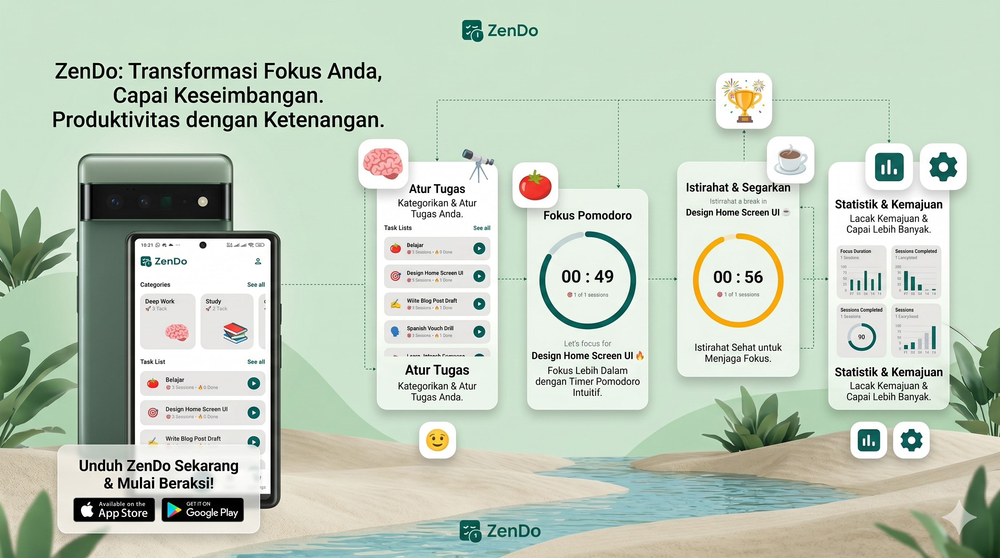

# ZenDo - Focus & Productivity App 🍅

ZenDo is a modern Android application designed to boost productivity using the **Pomodoro Technique** combined with efficient Task Management. Built with **Jetpack Compose** and **Clean Architecture**, ZenDo offers a seamless, beautiful, and focused user experience.


## ✨ Features

* **Pomodoro Timer:** Custom circular timer with focus/break intervals.
* **Ambient Sounds:** Play background white noise (Forest, Rain, etc.) using ExoPlayer.
* **Task Management:** Create, edit, and organize tasks.
* **Categories:** Group tasks into specific categories (Work, Study, Hobbies).
* **Modern UI:** 100% Jetpack Compose with Material 3 Design.
* **Cloud Sync:** Data persisted securely using Firebase Firestore.

## 🛠 Tech Stack

* **Language:** [Kotlin](https://kotlinlang.org/)
* **UI Framework:** [Jetpack Compose](https://developer.android.com/jetpack/compose) (Material 3)
* **Architecture:** Clean Architecture + MVVM (Model-View-ViewModel)
* **Dependency Injection:** [Hilt](https://dagger.dev/hilt/)
* **Asynchronous:** Coroutines & Flow
* **Navigation:** Navigation Compose
* **Backend:** Firebase (Firestore, Auth, Analytics)
* **Media:** Media3 (ExoPlayer) for ambient sounds
* **Image Loading:** Coil

## 📂 Project Structure

This project adheres to **Clean Architecture** principles to ensure scalability, testability, and separation of concerns.

```text
com.dinzio.zendo
├── app                         # App-level configuration (Hilt Application class)
├── core                        # Common components shared across layers
│   ├── data                    # Global data sources (Local & Remote)
│   ├── di                      # Global Dependency Injection modules
│   ├── navigation              # NavGraph & Route definitions
│   ├── presentation            # Global Presentation Layer (Reusable UI widgets, Screen)
│   ├── theme                   # Design system (Color, Type, Theme)
│   └── util                    # Helper functions & extensions
│
├── features                    # Feature-based architecture
│   ├── auth                    # Authentication (Login, Register)
│   ├── home                    # Home screen (Task & Category management)
│   ├── task                    # Task management (CRUD operations)
│   │   ├── data                # DATA LAYER (Repository Implementation & Data Sources)
│   │   │   ├── local           # Room DB (DAO, Entities) - *Optional/Offline Cache*
│   │   │   ├── remote          # Firebase/API integration (DTOs)
│   │   │   └── repository      # Implementation of Domain repositories
│   │   │
│   │   ├── domain              # DOMAIN LAYER (Business Logic - Pure Kotlin)
│   │   │   ├── model           # Core business models
│   │   │   ├── repository      # Repository interfaces
│   │   │   └── usecase         # Specific business logic (e.g., CalculateTimerUseCase)
│   │   │
│   │   └── presentation        # PRESENTATION LAYER (UI & State Holders)
│   │       ├── component       # Feature-based component (Component)
│   │       ├── screens         # Feature-based screens (Composable)
│   │       └── viewModel       # Feature-based ViewModel
│   │
│   ├── category                # Category management (CRUD operations)
│   └── timer                   # Timer management (Pomodoro Technique)
├── MainActivity.kt             # Entry point
└── MainViewModel.kt            # Main View Model
